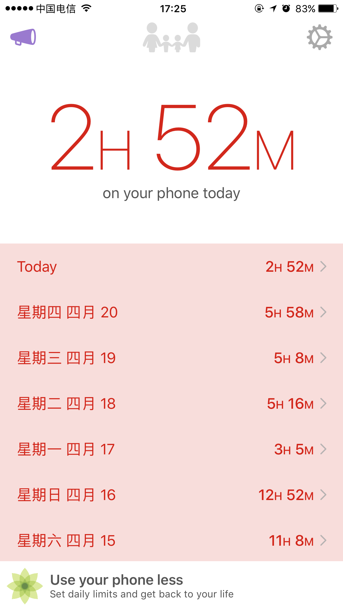
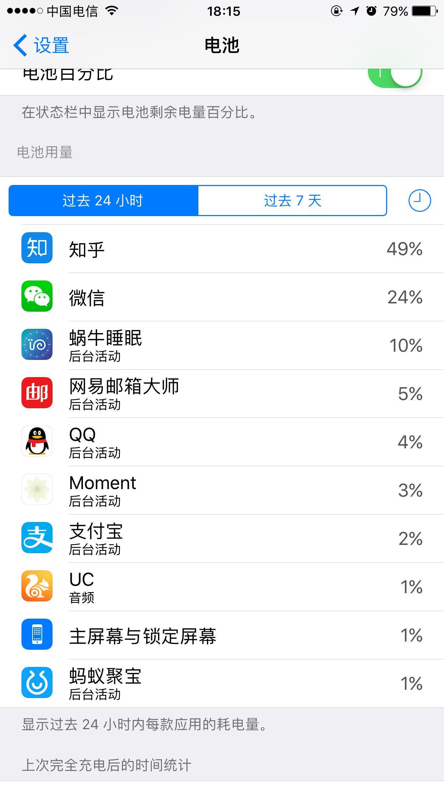
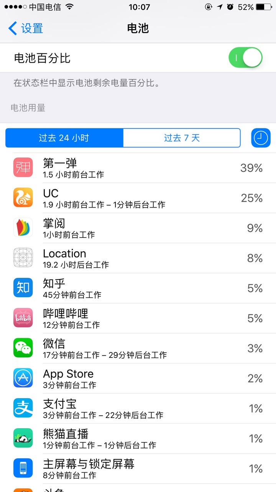

#Moment调查结果 
###调查目的  
#####Moment是否可持续后台，耗电情况，是否能自动启动，底层实现方式。
 
##应用介绍  
  
  
#### 功能：  
*  实现应用长时间驻留后台。  
*  实现应用在不主动打开的情况下，自动启动  
*  实现用户行为检测（检测是否解锁和锁屏）  

#### 应用主要特点
* 可实现不开启应用的情况下自动启动
* 可持续在后台检测
* 特别省电，仅比不使用此应用每天增加 5%的用电量
    
    
##调查过程和结果

#### 调查方式
 >通过查询stackoverflow,Google,github,baidu  
 
#### 调查结果  
实现自动启动 关键API
==startMonitoringSignificantLocationChanges==
>在注册此接口后，被用户或系统强行退出后，系统依然可以自动启动应用，进行关键位置定位  
  
编写测试Demo，测试此API,无法持续后台 ，仅可被系统唤醒10秒钟

#### 实现持续后台
通过查阅资料，可通过注册两个 CLLication 对象  

* 第一个用来控制 App自动启动  
* 第二个用来控制 App持续驻留后台    

#### APP持续驻留实现方式
1、每次进入应用后 通过 startMonitoringSignificantLocationChanges
 注册服务。  
 
2、注册过此服务后 系统会在 位置发生变化后自动唤醒应用，（实测，退出应用后在距离2公里的地方应用被自动唤醒了，手机没电自动关机后，充电完成后，也会自动唤醒应用）  

3、当应用唤醒后 只有10秒启动时间，这时候  创建新的 CLLocationManager 对象，利用startUpdatingLocatio 可将后台时间延长到180秒  

4、启动定时器，当检测到后台剩余小于30秒，在次调用 startUpdatingLocatio 可在次 将后台时间延长到 180秒
5、通过循环调用startUpdatingLocatio，实现无限制后台
#### 代码

```
- (BOOL)application:(UIApplication *)application didFinishLaunchingWithOptions:(NSDictionary *)launchOptions {
        
    //创建定位管理者单例
    SignificantLocationManager *manager = [SignificantLocationManager shareManager];
    manager.isUnStartBackgoundLocation = YES;
    //当launchOptions中有UIApplicationLaunchOptionsLocationKey表明是系统因为位置发生重大变化，自动启动了程序
    if (launchOptions[UIApplicationLaunchOptionsLocationKey]) {
        manager.isRunFromeSystem = YES;
        [[BackgroundLocationManager shareManager] sendLocalNoification];
    }
    //开始重大位置改变定位
    [manager startMonitoringSignificantLocationChanges];
     [self redirectDLogToDocumentFolder];
    
    return YES;
}
```
在 SignificantLocationManager的  didUpdateLocations 中 唤醒另一个 BackgroundLocationManager  

```
-(void)locationManager:(CLLocationManager *)manager didUpdateLocations:(NSArray<CLLocation *> *)locations
{
	if (self.isUnStartBackgoundLocation) {
	        if ([UIApplication sharedApplication].applicationState == UIApplicationStateBackground) {
	        self.isUnStartBackgoundLocation = YES;
	        BackgroundLocationManager *mange = [BackgroundLocationManager shareManager];
	            [mange startChickBgTime];
	        }
	    }
}
```
在另一个的 BackgroundLocationManager 中 开始 检查剩余后台时间

``` 
- (void)startChickBgTime {
    [self.bgTaskTimer invalidate];
    self.bgTaskTimer = nil;
    self.bgTaskTimer = [NSTimer scheduledTimerWithTimeInterval:1 target:self selector:@selector(bgTaskTimerAction) userInfo:nil repeats:YES];
     [[BGTask shareBGTask] beginNewBackgroundTask];
}

```
当后台时间 小于30秒 申请定位  

``` 
- (void)bgTaskTimerAction {
    NSTimeInterval backgroundTimeRemaining = [[UIApplication sharedApplication] backgroundTimeRemaining];
    if (backgroundTimeRemaining == DBL_MAX){
        NSLog(@"B=T=R = Undetermined");
    } else {
        NSLog(@"B=T=R = %.02f ", backgroundTimeRemaining);
        if (backgroundTimeRemaining < 30 && self.isStartUpdatingLocation == NO) {
            NSLog(@"开始定位");
            self.isStartUpdatingLocation = YES;
            [self startUpdatingLocation];
        }
    }
}
``` 
在定位成功后，在次申请后台时间 180秒

``` 
-(void)locationManager:(CLLocationManager *)manager didUpdateLocations:(NSArray<CLLocation *> *)locations
{
    //这个是我封装的用来获取后台时间的一个单例
    [[BGTask shareBGTask] beginNewBackgroundTask];
    [self stopUpdatingLocation];
    self.isStartUpdatingLocation = NO;
}
``` 
#### 优化后测试结果  

| 测试方式       | 是否自动启动     | 是否持续后台|
| ------------- |:-------------:| -------------:|
| 主动退出应用    | 是            |是         |
| 关机后启动      | 是            | 是        | 
#### 利用此API可实现的功能

* 1、实现后台驻留
* 2、实现自动启动
* 3、实现用户回家后，自动开始睡眠监测  

#### 尚未解决的问题   

* 1、如果用户主动退出后，长时间没有移动，一直驻留在同一个位置，无法自动启动 尚无法解决
* 2、耗电，当前耗电量 无法达到Moment 那样 一天的耗电量仅为 5%  
* 3、如果用户开启飞行模式，无法实现后台驻留，自动启动
* 4、如果用户关闭 定位权限 无法实现后台驻留，自动启动


>问题1： 这个问题Moment也存在 如果一直待在同一个地方是没办法自动启动的  
>问题2： 耗电我尝试了好几种方式，包括将定位范围放到最大，和每次定位完成关闭定位，都无法解决，目前耗电量 8%  
>问题3，问题4:自动启动是关键，但是关闭应用权限的情况下是没有办法自动启动的，如果能自动启动，可以换 静默音持续后台

### 目前耗电
测试 19.2小时 耗电量 8%
    


## 调研资料  
https://wigl.github.io/2015/08/28/ios_location_introduction/  
官方 API介绍
https://developer.apple.com/library/content/documentation/UserExperience/Conceptual/LocationAwarenessPG/RegionMonitoring/RegionMonitoring.html#//apple_ref/doc/uid/TP40009497-CH9
